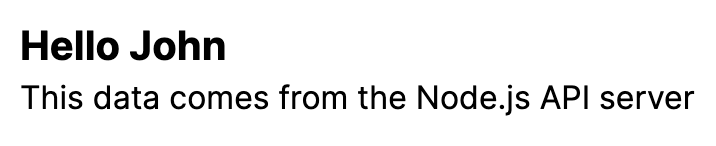

# Next.js + Node.js Backend

This is a template starter project for a Next.js frontend with a Node.js backend

#### Screenshot



## Getting Started

- Clone the repository
- `cd` into the repository, then run:

```bash
npm install
npm install --prefix server
npm install --prefix client
```

- To start the server, run:

```bash
npm run dev
```

> TIP: We are using `concurrently` to run both the server and the client at the same time from the root directory

- Open your browser and navigate to `http://localhost:3000`

> TIP: the server runs on port 4000 and the client runs on port 3000
>
> In production you should add a `CLIENT_URL` environment variable to the server with the URL of the client and also update the `serverURL` in `client/config/server` with the URL of the server

## Folder Structure

- `client`: Contains the Next.js frontend
- `server`: Contains the Node.js backend

## Resources

- [Next.js Documentation](https://nextjs.org/docs)
- [Node.js Documentation](https://nodejs.org/en/docs/)
- [Express.js Documentation](https://expressjs.com/)
- [Concurrently Documentation](https://www.npmjs.com/package/concurrently)
- [Nodemon Documentation](https://www.npmjs.com/package/nodemon)

## License

- [MIT](LICENSE.md)
